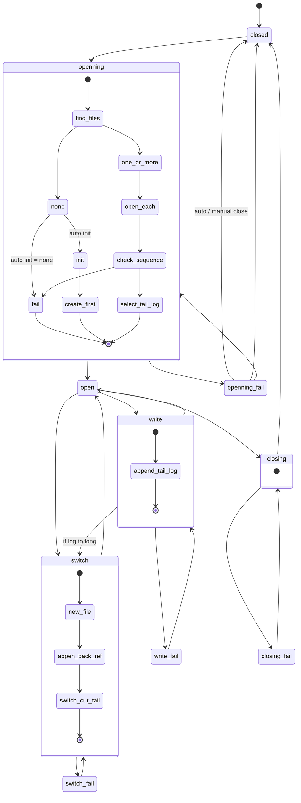

Состояние LogQueue
============================

```mermaid
stateDiagram-v2

closed
open

closed --> openning
openning --> open

open --> closing
closing --> closed
open --> switch 
switch --> open
open --> write
write --> open 
write --> switch : if log to long
write --> write_fail
write_fail --> write
openning --> openning_fail
openning_fail --> closed : auto / manual close 
openning_fail --> openning
openning_fail --> closed
switch --> switch_fail
switch_fail --> switch
closing --> closing_fail
closing_fail --> closing

[*] --> closed

state openning {
    [*] --> find_files
    find_files --> one_or_more
    find_files --> none
    none --> fail : auto init = none
    fail --> [*] 
    none --> init : auto init
    one_or_more --> open_each
    init --> create_first
    create_first --> [*]
    open_each --> check_sequence
    check_sequence --> fail
    check_sequence --> select_tail_log
     select_tail_log --> [*]
}

state closing {
    [*]
}

state switch {
    [*] --> new_file
    new_file --> appen_back_ref
    appen_back_ref --> switch_cur_tail
    switch_cur_tail --> [*]
}

state write {
    [*] --> append_tail_log
    append_tail_log --> [*]
}

```